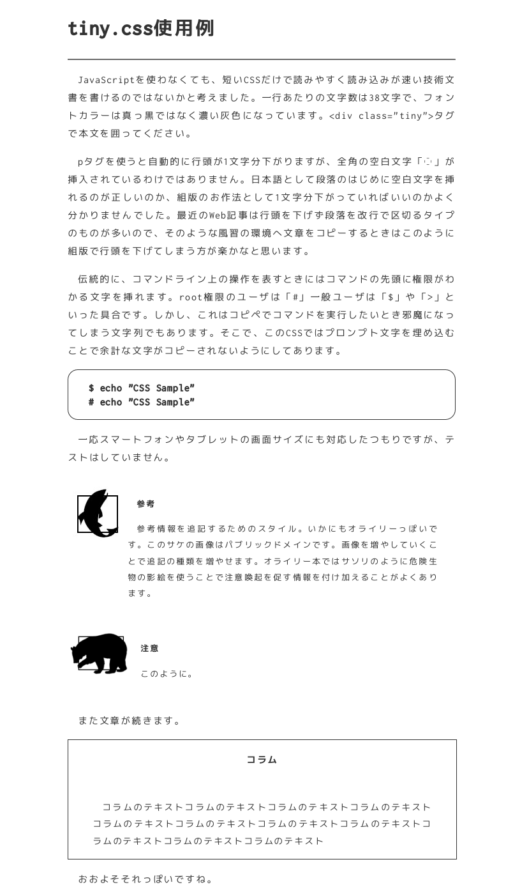

# tinyCSS

Tiny CSS for simple and fast web documentation without JavaScript.

## Installation

Copy `tiny.css` into your website. Then write `<link rel="stylesheet" type="text/css" href="tiny.css">` in HTML header.

Use `tiny` class for main contents.

## Compress CSS

`make` and `Pipenv` is requried.

```
$ cd tools/compressor
$ make
```

You can see compressed CSS. Use it or redirect to your CSS.

## Sample



Read `sample/sample.html` for details.
